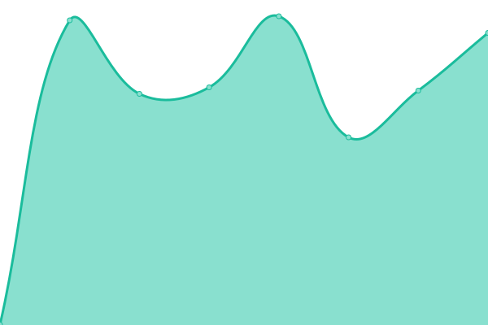
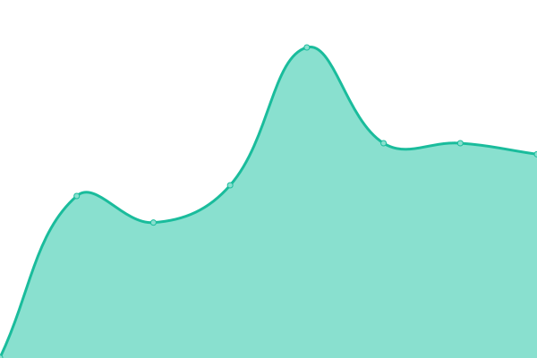
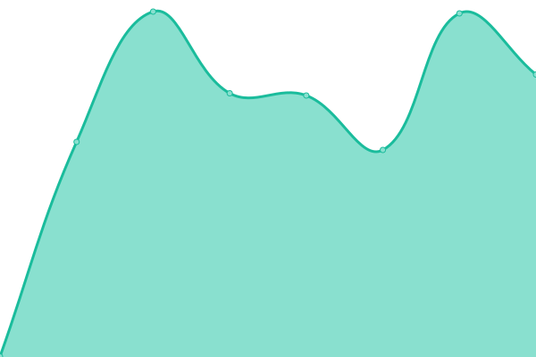

# [📈 Live Status](https://demo.upptime.js.org): <!--live status--> **🟧 Partial outage**

This repository contains the open-source uptime monitor and status page for [Upptime](https://upptime.js.org), powered by [Upptime](https://github.com/upptime/upptime).

With [Upptime](https://upptime.js.org), you can get your own unlimited and free uptime monitor and status page, powered entirely by a GitHub repository. We use [Issues](https://github.com/upptime/upptime/issues) as incident reports, [Actions](https://github.com/cotezos/umami-api-endpoints/actions) as uptime monitors, and [Pages](https://demo.upptime.js.org) for the status page.

<!--start: status pages-->
<!-- This summary is generated by Upptime (https://github.com/upptime/upptime) -->
<!-- Do not edit this manually, your changes will be overwritten -->
<!-- prettier-ignore -->
| URL | Status | History | Response Time | Uptime |
| --- | ------ | ------- | ------------- | ------ |
|  [Umami API mainnet](https://mainnet.umamiwallet.com/monitor/blocks) | 🟥 Down | [umami-api-mainnet.yml](https://github.com/cotezos/umami-api-endpoints/commits/HEAD/history/umami-api-mainnet.yml) | 

 514ms
     
 | 

<a href="https://cotezos.github.io/umami-api-endpoints/history/umami-api-mainnet">52.25%</a>
    

|  [Umami API ghostnet](https://ghostnet.umamiwallet.com/monitor/blocks) | 🟩 Up | [umami-api-ghostnet.yml](https://github.com/cotezos/umami-api-endpoints/commits/HEAD/history/umami-api-ghostnet.yml) | 

 535ms
     
 | 

<a href="https://cotezos.github.io/umami-api-endpoints/history/umami-api-ghostnet">100.00%</a>
    

|  [QA Umami API mainnet - testing - do not use](https://mainnet-qa.umamiwallet.com/monitor/blocks) | 🟥 Down | [qa-umami-api-mainnet-testing-do-not-use.yml](https://github.com/cotezos/umami-api-endpoints/commits/HEAD/history/qa-umami-api-mainnet-testing-do-not-use.yml) | 

 905ms
     
 | 

<a href="https://cotezos.github.io/umami-api-endpoints/history/qa-umami-api-mainnet-testing-do-not-use">52.25%</a>
    

|  [QA Umami API ghostnet - testing - do not use](https://ghostnet-qa.umamiwallet.com/monitor/blocks) | 🟩 Up | [qa-umami-api-ghostnet-testing-do-not-use.yml](https://github.com/cotezos/umami-api-endpoints/commits/HEAD/history/qa-umami-api-ghostnet-testing-do-not-use.yml) | 

 695ms
     
 | 

<a href="https://cotezos.github.io/umami-api-endpoints/history/qa-umami-api-ghostnet-testing-do-not-use">100.00%</a>
    

<!--end: status pages-->

[**Visit our status website →**](https://demo.upptime.js.org)

## 📄 License

- Powered by: [Upptime](https://github.com/upptime/upptime)
- Code: [MIT](./LICENSE) © [Upptime](https://upptime.js.org)
- Data in the `./history` directory: [Open Database License](https://opendatacommons.org/licenses/odbl/1-0/)
